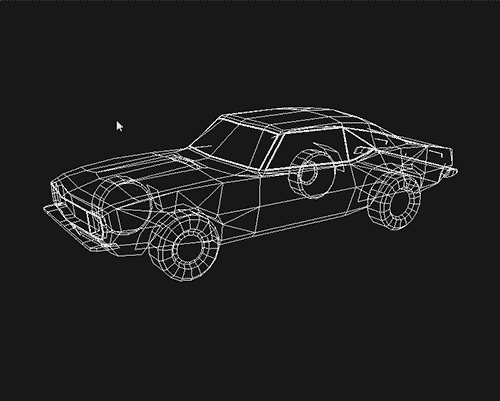
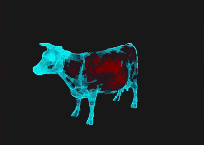
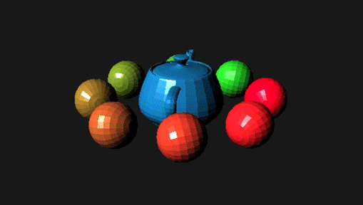

# SoftwareRenderer
A simple software rasterize renderer for [CSCI 6554 Computer Graphics II](https://icg.gwu.edu/academics)
## Lab1 Viewing Transform

## Lab2 Scan Conversion

## Lab3 Shading

## Lab4 Texture Mapping
